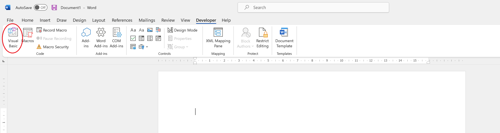
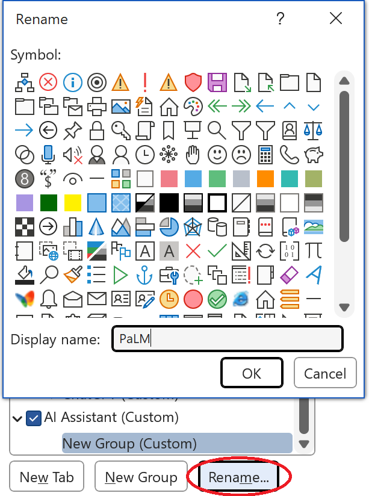
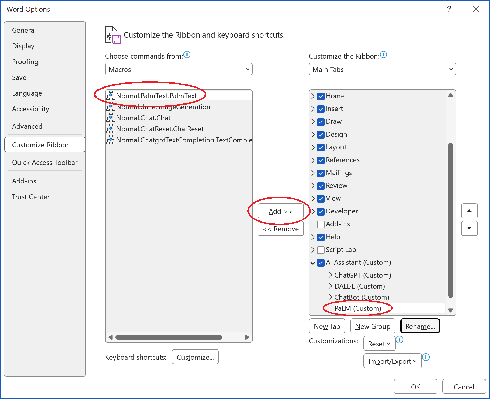
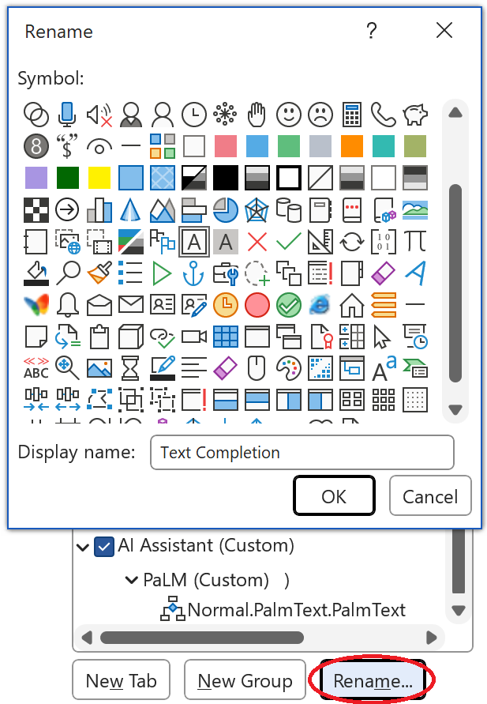
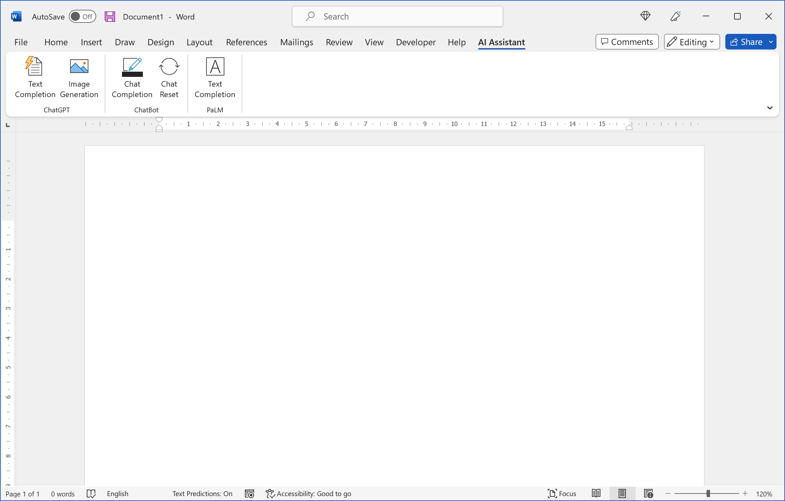
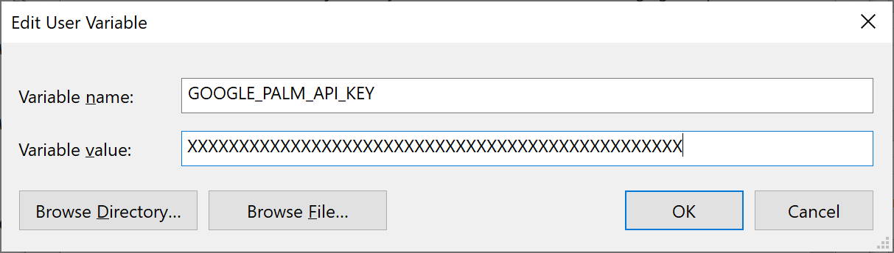

<h1 align="center">Integrate PaLM into Word</h1>

<!-- badges: start -->
<div align="center">
  
<!-- &nbsp;&nbsp;-->
[](https://github.com/analyticsinmotion/integrate-palm-into-word/blob/main/LICENSE)&nbsp;&nbsp;
&nbsp;&nbsp;
&nbsp;&nbsp;
[](https://ai.google/discover/palm2)&nbsp;&nbsp;
[](https://www.analyticsinmotion.com)&nbsp;&nbsp;
  
</div>
<!-- badges: end -->

<!-- DESCRIPTION -->
## Description
Rapidly test, utilize, and compare Google's latest language model **PaLM2** in Microsoft Word. PaLM 2 is a state-of-the-art language model that boasts upgraded features in terms of its multilingual capacity, reasoning ability, and coding capabilities.
By integrating PaLM 2 into Microsoft Word, this project aims to make the latest in Google's advanced AI capabilities directly accessible and easy to use.
<br /><br />


https://github.com/analyticsinmotion/integrate-palm-into-word/assets/52817125/720592f1-8ce8-4249-96a6-fa5c8b0eac1a


<br />


<!-- GETTING STARTED -->
## Getting Started
### Dependencies
- Requires an MakerSuite API Key (apply for the waitlist here: <a href="https://makersuite.google.com/app/apikey">https://makersuite.google.com/app/apikey</a>)
- Requires Microsoft Windows 10/11 (<a href="https://www.microsoft.com/en-au/windows">https://www.microsoft.com/en-au/windows</a>)
- Requires Microsoft Word 365 (<a href="https://www.microsoft.com/en-us">https://www.microsoft.com/en-us</a>)

Please be aware that access to PaLM API and Makersuite are currently only available in the *United States*. Users will receive a "400:Bad Request" message should they try to use this project outside the available regions. To monitor available regions please check here: [https://developers.generativeai.google/available_regions](https://developers.generativeai.google/available_regions)

In addition, the PaLM API is currently in public preview. Please read the [PaLM API and MakerSuite Additional Terms of Service](https://developers.generativeai.google/terms) for more information. 
<br /><br />

<!-- Installation -->
## Installation

There are 4 basic steps in order to add PaLM's Text Generation capability into Microsoft Word:
  1. Enable the Developer Tab
  2. Import the VBA script file
  3. Create the PaLM Text Completion button
  4. Add your MakerSuite API Key

Each of these steps are fully outlined in the expandable sections below. 

<details>
  <summary><h3>&nbsp;Enable the Developer Tab</h3></summary>

The Developer tab isn't displayed by default, but you can add it to the ribbon.

**Step 1** - On the File tab, go to Options > Customize Ribbon.

**Step 2** - Under Customize the Ribbon and under Main Tabs, select the Developer check box.

  

<br />

The latest instructions to enable the Developer Tab from Microsoft can be found here: 
<a href="https://support.microsoft.com/en-us/office/show-the-developer-tab-in-word-e356706f-1891-4bb8-8d72-f57a51146792">https://support.microsoft.com/en-us/office/show-the-developer-tab-in-word-e356706f-1891-4bb8-8d72-f57a51146792</a>
</details>

<details>
  <summary><h3>&nbsp;Import the VBA script file</h3></summary>

**Step 1** - Download and Save the latest ```PalmText.bas``` file from the src/windows folder in this repository.
<br />

Keep the location of where the file is saved as you will need it later.<br />

**Step 2** - On the Developer tab, click the Visual Basic button.

<br />

**Step 3** - On the File tab, go to Import File...


<br />
&nbsp;

**Step 4** - Select the ```PalmText.bas``` file and click Open
</details>


<details>
  <summary><h3>&nbsp;Create the PaLM Text Completion button</h3></summary>

*Please Note:* This project uses the same ribbon as three of our other projects: 
 - **Add ChatGPT to Microsoft Word** - project can be found <a href="https://github.com/analyticsinmotion/add-chatgpt-to-microsoft-word">here</a> 
 - **Create Images with DALL·E in Microsoft Word** - project can be found <a href="https://github.com/analyticsinmotion/create-images-with-dall-e-in-microsoft-word">here</a> 
 - **Add GPT Chatbot to Microsoft Word** - project can be found <a href="https://github.com/analyticsinmotion/add-gpt-chatbot-to-microsoft-word">here</a>

If you have have already added any one of these projects into Microsoft Word you can start at Step 3 of this section.
<br /><br />

**Step 1** - Add a new tab
<br />
  - On the File tab, go to Options > Customize Ribbon
  - Click New Tab
<br />


<br />
&nbsp;

 **Step 2** - Rename the New Tab to **AI Assistant**


<br />
&nbsp;

**Step 3** - Rename New Group (Custom) to **PaLM**


<br />
&nbsp;

**Step 4** - Select Macros in the Choose Commands from dropdown box


<br />
&nbsp;

**Step 5** - Select the PaLMText Macro and click Add >>


<br />
&nbsp;

**Step 6** - Rename button from *Normal.PalmText.PalmText* to **Text Completion**, select a Symbol and click OK


<br />
&nbsp;

After the preceding steps have been completed the Microsoft Word screen should look like the following:


<br />
</details>


<details>
  <summary><h3>&nbsp;Add your MakerSuite API Key</h3></summary>

**Step 1** - Open the Start menu and start typing "environment variables". When the best match appears click "Edit the system environment variables" result.


<br />
&nbsp;

**Step 2** - Click the "Environment variables" button under the "Advanced" tab.


<br />
&nbsp;

**Step 3** - Create a new user variable by clicking "New" under the "User Variables" section.


<br />
&nbsp;

**Step 4** - Type the variable name **GOOGLE_PALM_API_KEY** in the first field and your MakerSuite API KEY in the variable value field. Then click OK.


<br />
&nbsp;

**Step 5** - **IMPORTANT** You must restart Windows to apply the new environment variable
</details>

<br />


<!-- AI Model -->
## AI Model Information

This application uses the following Pathways Language Model:
 
| Generation  | Model | Description | Max Input | Max Output | Temperature | top_p | top_k |
| ------------- | ------------- |------------- | ------------- | ------------- | :-----------: | :-----------: | :-----------: |
| PaLM 2  | text-bison-001 | Model targeted for text generation | 8,196 tokens | 1,024 tokens | 0.7 | 0.95 | 40 |

Further information about this model can be found here: 
- <a href="https://blog.google/technology/ai/google-palm-2-ai-large-language-model/">https://blog.google/technology/ai/google-palm-2-ai-large-language-model/</a>
- <a href="https://ai.googleblog.com/2022/04/pathways-language-model-palm-scaling-to.html">https://ai.googleblog.com/2022/04/pathways-language-model-palm-scaling-to.html</a>
<br /><br />

<!-- Best Practices for API Key Safety -->
## Best Practices for API Key Safety

Your MakerSuite API KEY key/s should be kept secure and private at all times.

Please follow the best practices guide for API security from Google:
<br />
<a href="https://support.google.com/googleapi/answer/6310037?hl=en">https://support.google.com/googleapi/answer/6310037?hl=en</a>


<br />

<!-- Disclaimers -->
## Disclaimers
- This project/repository is an independent initiative created for testing purposes and convenience.
- This project/repository is not affiliated with, endorsed, approved or sponsored by Microsoft Corporation, its subsidiaries or any other affiliates. 
- This project/repository is not affiliated with, endorsed, approved or sponsored by Alphabet Inc., its subsidiary Google or any other affiliates.
- This project is experimental and contains API's and code that are not ready for any type of Production usage. Support and/or new releases may be limited.

<br />
